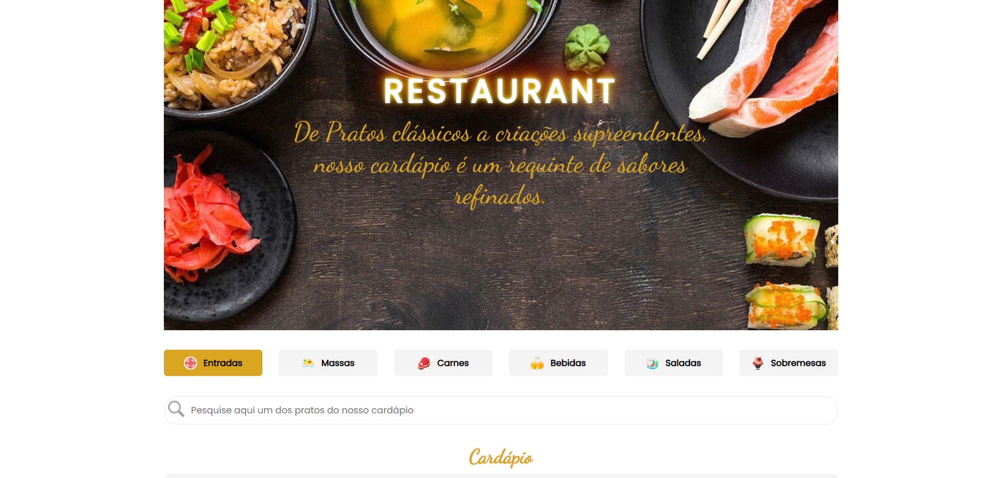
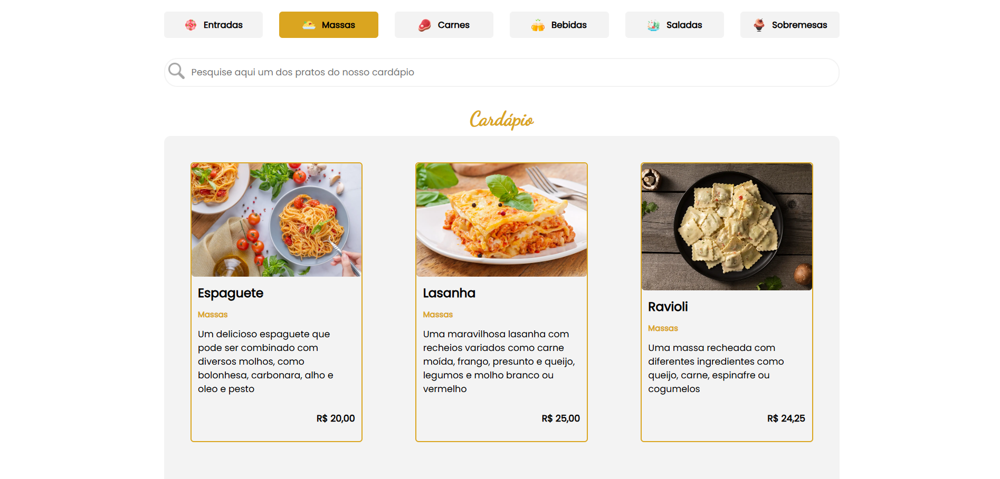
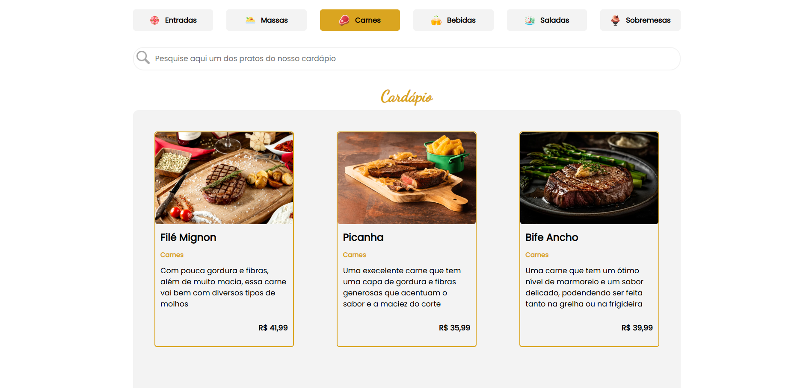
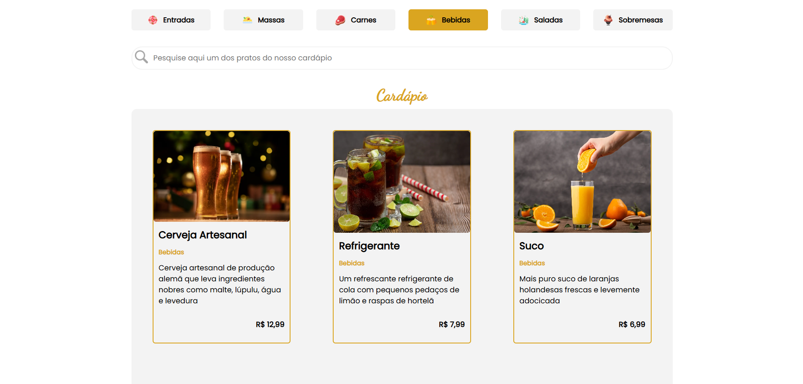
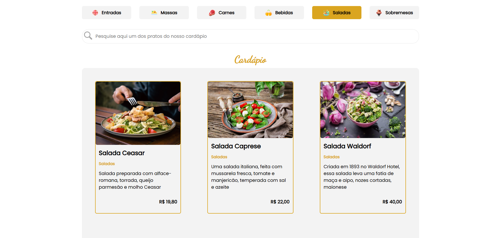
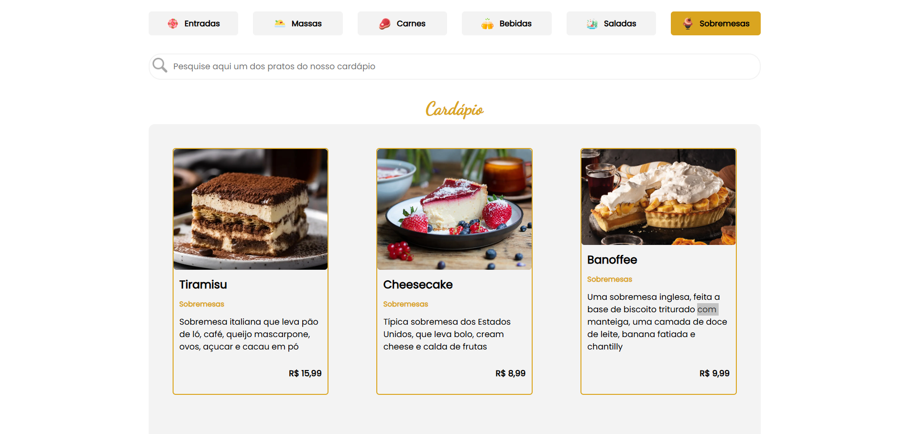

# Cardápio

## Objetivo

Desenvolver uma aplicação de cardápio digital utilizando Next.js, proporcionando uma navegação fluida, rápida e otimizada. A aplicação permitirá que os usuários pesquisem pratos específicos por meio de uma barra de pesquisa e filtrem os itens por categoria (Entradas, Massas, Carnes, Bebidas, Saladas e Sobremesas), garantindo uma experiência intuitiva e eficiente.

Tecnologias utilizadas:
- Next.js – Para otimização e renderização eficiente.
- React Hooks – Para gerenciamento de estado.
- TailwindCSS – Para uma interface moderna e responsiva.

Funcionalidades Principais:
- Página Inicial – Exibe os pratos disponíveis com imagens e descrições.
- Barra de Pesquisa – Permite buscar pratos pelo nome ou descrição.
- Filtros por Categoria – Facilita a navegação entre diferentes tipos de pratos.
- Página de Detalhes do Prato – Exibe informações detalhadas, ingredientes e preço.
- Design Responsivo – Adaptado para mobile, tablet e desktop.

Este projeto tem como objetivo proporcionar uma experiência moderna e fluida para clientes e restaurantes, utilizando as melhores práticas do Next.js para um cardápio interativo, rápido e organizado. 🚀🍽️

### Conhecendo o projeto

O projeto que foi criado pode ser visto abaixo.

<figure>
  
  <figcaption align="center">
    Figura 1.
    
  Topo do Projeto.</figcaption>
</figure>

<figure>
  
  <figcaption align="center">
    Figura 2.
    
  Categoria Entradas.</figcaption>
</figure>

<figure>
  
  <figcaption align="center">
    Figura 3.
    
  Categoria Massas.</figcaption>
</figure>

<figure>
  
  <figcaption align="center">
    Figura 4.
    
  Categoria Carnes.</figcaption>
</figure>

<figure>
  
  <figcaption align="center">
    Figura 5.
    
  Categoria Bebidas.</figcaption>
</figure>

<figure>
  
  <figcaption align="center">
    Figura 6.
    
  Categoria Saladas.</figcaption>
</figure>

<figure>
  
  <figcaption align="center">
    Figura 7.
    
  Categoria Saladas.</figcaption>
</figure>

### `npm start`

Para rodar o projeto no modo de desenvolvimento, execute o comando `npm dev`.
Abra [http://localhost:3000](http://localhost:3000 para visualizá-lo em seu navegador.

### `deploy`

O deploy da aplicação foi realizado na plataforma [Vercel](https://vercel.com/).
E poderá ser acompanhado através do seguinte link: [Cardápio](https://projeto-cardapio-iota.vercel.app/).